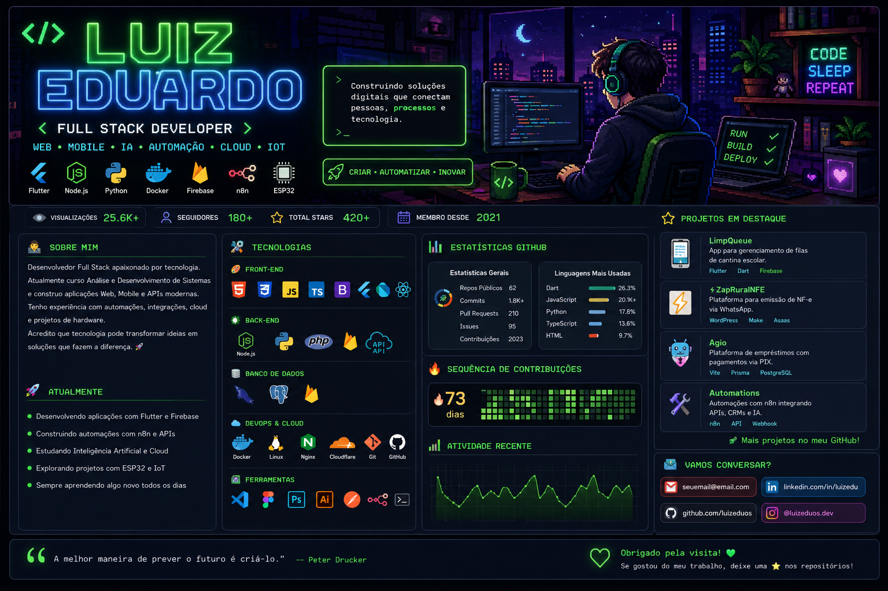

# 👋 Olá, eu sou Luiz Eduardo

### Full Stack Developer • Cloud • IA • Flutter • Automação

Transformando ideias em soluções através da tecnologia.

---

# 🚀 Sobre mim

Sou desenvolvedor **Full Stack** apaixonado por criar soluções escaláveis para empresas.

Atuo no desenvolvimento de:

- 🌐 Sistemas Web
- 📱 Aplicativos Flutter
- ☁️ Infraestrutura Cloud
- 🤖 Inteligência Artificial
- ⚡ Automações Empresariais
- 🔗 Integrações entre sistemas
- 📊 Dashboards
- 🐳 Docker
- 🔌 IoT com ESP32

Atualmente curso **Análise e Desenvolvimento de Sistemas**.

---

# 💻 Stack

### Front-end

### Back-end

### Banco de Dados

### DevOps

### Ferramentas

---

# 📊 Estatísticas

  
  

---

# 🔥 Sequência

---

# 📈 Atividade

---

# 🚀 Projetos

## 🌐 Nuuv Tecnologia

**Site:** https://nuuvtecnologia.com.br

Empresa focada em desenvolvimento de software sob medida, integrações corporativas e implantação de ERP para empresas. Atua com integração entre sistemas como Sankhya, Odoo, SAP e TOTVS, além de automação de processos, desenvolvimento web/mobile e APIs personalizadas. :contentReference[oaicite:0]{index=0}

**Tecnologias**

`Node.js` `Flutter` `Docker` `Odoo` `REST API`

---

## ☁️ Nuuv Cloud

**Site:** https://nuuv.cloud

Plataforma especializada em infraestrutura cloud para ambientes corporativos, oferecendo hospedagem para ERP, monitoramento contínuo, backup, segurança e alta disponibilidade para aplicações críticas. :contentReference[oaicite:1]{index=1}

**Tecnologias**

`Docker` `Linux` `Cloud` `Nginx`

---

## 🤖 Sellera

**Site:** https://sellera.sale

Plataforma de automação comercial com Inteligência Artificial, CRM integrado e integração multicanal, voltada para gestão de leads, atendimento automatizado e aumento de conversão de vendas. :contentReference[oaicite:2]{index=2}

**Tecnologias**

`OpenAI`

`n8n`

`WhatsApp`

`CRM`

`REST API`

---

# 🚀 Áreas de Interesse

- Inteligência Artificial
- Cloud Computing
- Flutter
- Desenvolvimento Web
- Arquitetura de Software
- Docker
- APIs
- ERP
- Automação
- IoT
- ESP32

---

# 📫 Contato

| |
|---|
| 🌐 **Portfólio:** https://luizeduos.web.app |
| 💼 **LinkedIn:** https://linkedin.com/in/luizeduos |
| 📧 **Email:** luiz@nuuv.cloud |
| 🐙 **GitHub:** https://github.com/luizeduos |

---

### 💚 Obrigado pela visita!

*"A tecnologia move o mundo. O código transforma ideias em realidade."*

⭐ Se algum projeto foi útil para você, considere deixar uma estrela.

